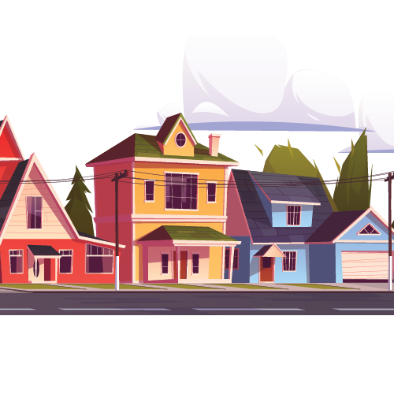

# Data Privacy Practices Cards

The goal of the project is to inform users about the data privacy, security, usage, analysis, interpretation practices while browsing social media web pages. 

## Integrate Cards to Your Web Application

Add the following files to your web application:
````
./card/dataflow.js
./card/style.css
./images
./lib
````

Use ```bindPopUpBeforeElement(_el, _popUpJSON)``` or ```bindPopUpInsideElement(_el, _popUpJSON)``` to add the popup to your HTML element. In the ``dataflow.js`` file you can see the list of available popup contents.

## Content of the Cards

**Content**

1. Most platforms make customizations based on your location.
2. They are collecting info to customize the content and create interest groups.
3. You can control your recommendations.
4. Content creators try to bait you.
5. Content creators understand how the algorithm works.
6. Online ads try to bait you.
7. The content can be fake. Generative models look really good.
8. The content can miss some aspects of the issue. → Cherry Picking
9. Just because something is online does not mean it is true.
10. Best way to determine credibility is using your common sense.

**Security**

1. Using strong passwords can help you to survive a hacker attack.
2. Using two-factor authentication makes you more secure.

**Digital Footprints**
1. Your visiting history is your digital footprint.
2. Your interaction with the community (likes, comments etc) is your digital footprint.
3. Your recorded videos are forever online.
4. Your digital footprint can be seen by everyone.

**Social**

1. Becoming a community needs effort
2. You can handle cyberbullying in multiple ways → Ignore, Block, Report
3. It is easy to misunderstand something online.
4. The person can be another person who they say they are.
5. Before sharing, think about the impacts.
6. Using a constructive language benefits everyone

## Using Cards as an Educational Activity

Teachers and parents can use our _fill in the blanks_ type of cards as discussion starters. They can fill these cards together while visiting the different web pages.



Another possible activity is handing the information cards to group of students and ask them to give different examples that they encounter during their web browsing experience.


## Using it as Browser Extension

After downloading, to use the extension on Chrome:
1. Open the Extension Management page by navigating to ```chrome://extensions```
2. The Extension Management page can also be opened by clicking on the Chrome menu, hovering over More Tools then selecting Extensions.
3. Enable Developer Mode by clicking the toggle switch next to Developer mode.
4. Click the ```LOAD UNPACKED``` button and select the extension directory.

[More details of developing Chrome Extension](https://developer.chrome.com/docs/extensions/mv2/getstarted/)

After downloading, to use the extension on Firefox:
1. Open the ```about:debugging``` page, 
2. Click "This Firefox" (in newer versions of Firefox), 
3. Click "Load Temporary Add-on", 
4. Then select any file in your extension's directory.

[More details of developing Firefox Extension](https://developer.mozilla.org/en-US/docs/Mozilla/Add-ons/WebExtensions/Your_first_WebExtension)

## Media Attributes
We used the following free-license media in our cards:

- <a href='https://www.freepik.com/vectors/tree'>Tree vector created by upklyak - www.freepik.com</a>
- <a href="https://www.vecteezy.com/free-vector/application">Application Vectors by Vecteezy</a>
- <a href='https://www.freepik.com/vectors/business'>Business vector created by vectorjuice - www.freepik.com</a>
- <a href='https://www.freepik.com/vectors/table'>Table vector created by stories - www.freepik.com</a>
- <a href='https://www.freepik.com/free-vector/popup-banner-collection-concept_2784847.htm#page=1&query=click%20bait&position=4'>Click Bait- www.freepik.com</a>
- <a href='https://www.thedailystar.net/shout/the-internet/news/five-stages-dealing-clickbait-1734130'> Dealing Clickbait - The Daily Star</a>
- <a href='https://www.freepik.com/vectors/infographic'>Infographic vector created by katemangostar - www.freepik.com</a>
- <a href="https://www.vecteezy.com/free-vector/mind">Mind Vectors by Vecteezy</a>
- <a href='https://www.freepik.com/vectors/technology'>Technology vector created by freepik - www.freepik.com</a>
- <a href='https://www.freepik.com/vectors/background'>Background vector created by freepik - www.freepik.com</a>
- <a href='https://www.freepik.com/vectors/people'>People vector created by macrovector - www.freepik.com</a>


